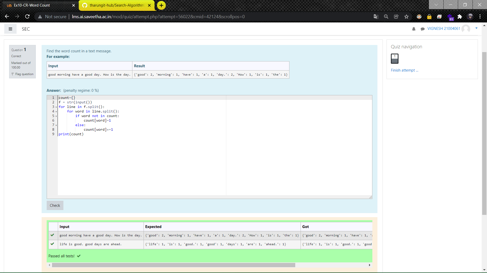

# Word-count
## AIM:
To write a python program for getting the word count from a text.
## EQUIPEMENT'S REQUIRED: 
PC
Anaconda - Python 3.7
## ALGORITHM: 
### Step 1:
Get the string from user
### Step 2: 
 count will check repeated words in given string
### Step 3: 
use split() to split the string
### Step 4:  
now check every word in string 
### Step 5: 
print the count
### Step 6: 
End the program
## PROGRAM:
~~~
''' 
Program for getting the word count from a text
Developed by: M VIGNESH
RegisterNumber: 21004061
'''
count={}
f = str(input())
for line in f.split():
    for word in line.split():
        if word not in count:
            count[word]=1
        else:
            count[word]+=1
print(count)
~~~

### OUTPUT:

## RESULT:
Thus the program is written to find the word count from a text.
